# 🐦 Mini Recommendation System

Educational implementation covering core concepts from [Twitter's algorithm](https://github.com/twitter/the-algorithm).

## Contents

- [Architecture Overview](#architecture-overview)
- [End-to-End Flow](#end-to-end-flow)
- [Component Details](#component-details)
  - [1. Pipeline Framework](#1-pipeline-framework)
  - [2. Candidate Sources](#2-candidate-sources)
  - [3. Scoring Models](#3-scoring-models)
  - [4. Post-Processing](#4-post-processing)
- [Data Flow & Feature Engineering](#data-flow--feature-engineering)
- [How to Use](#how-to-use)
  - [Quick Start (Automated)](#quick-start-automated)
  - [Manual Steps](#manual-steps)
- [Running](#running)
  - [Step 1: Generate Synthetic Dataset](#step-1-generate-synthetic-dataset)
  - [Step 2: Train PyTorch Models](#step-2-train-pytorch-models-optional---requires-pytorch)
  - [Step 3: Run Recommendation System](#step-3-run-recommendation-system)
  - [Step 4: Run Evaluation](#step-4-run-evaluation)
  - [Understanding the Output](#understanding-the-output)
- [File Structure](#file-structure)
  - [Module Details](#module-details)
- [Key Concepts](#key-concepts)
  - [Synthetic Dataset](#synthetic-dataset)
  - [PyTorch Models](#pytorch-models)
  - [Multi-Head Scoring](#multi-head-scoring)
  - [Diversity & Safety](#diversity--safety)
  - [Evaluation Methodology](#evaluation-methodology)
- [Limitations & Comparison](#limitations--comparison)
- [How It Works (Step-by-Step)](#how-it-works-step-by-step)
- [Mapping to Twitter's Codebase](#mapping-to-twitters-codebase)
  - [Key Differences from Production](#key-differences-from-production)

## Architecture Overview


## End-to-End Flow


## Component Details

### 1. **Pipeline Framework**
Base execution framework orchestrating the entire flow.

### 2. **Candidate Sources** 
Fetches candidates using **three complementary embeddings**, each serving a distinct purpose:

#### Why Three Embedding Types?

**1. SimClusters - Sparse Community Embeddings (Hash-based)**
- **Role**: Fast, scalable interest-based clustering
- **Mechanism**: Deterministic `hash(interest) % 150` maps each user interest to a cluster bucket. Collisions (different interests landing in same bucket) aggregate weight; scores are normalized to create sparse vectors (typically 1-3 active clusters). No training or graph traversal—pure O(1) assignment.
  - *Note: Production SimClusters uses Metropolis-Hastings community detection on follow graphs. This mimic is a hash-based proxy preserving sparse embedding structure.*
- **Strengths**: 
  - Extremely fast (O(1) lookup via hashing)
  - Low memory footprint (sparse vectors, only 1-3 active clusters)
  - Interpretable (each cluster = topic community)
- **Weaknesses**: 
  - Coarse-grained (misses nuanced interests)
  - Hash collisions (unrelated users in same cluster)
- **Use Case**: Broad interest matching, initial candidate filtering (InNetwork source)

**2. TwHIN - Dense Semantic Embeddings (Trained Neural Network)**
- **Role**: Precise semantic similarity for discovery
- **Mechanism**: Two-tower neural network learns 128-dim dense vectors capturing deep semantic relationships
- **Strengths**:
  - High accuracy (captures subtle preferences)
  - Continuous space (smooth similarity gradients)
  - Learned from engagement data (real behavioral signals)
- **Weaknesses**:
  - Computationally expensive (neural network inference)
  - Requires training data and periodic retraining
  - Black box (less interpretable)
- **Use Case**: Out-of-network discovery, finding semantically similar content users haven't seen (OutOfNetwork source)

**3. RealGraph - Social Graph Features (Rule-based)**
- **Role**: Explicit social connections and demonstrated preferences
- **Mechanism**: Direct follow relationships, mutual connections, observed interaction patterns
- **Strengths**:
  - High precision (explicit signals)
  - Real-time updates (no retraining needed)
  - Trustworthy (based on user actions, not predictions)
- **Weaknesses**:
  - Limited to social network structure
  - Cold start problem (new users have no graph)
  - Echo chamber risk (only shows connected content)
- **Use Case**: High-confidence recommendations from social connections (Graph source)

#### Why All Three Are Necessary

**Complementary Coverage:**
- **SimClusters**: Broad reach, finds topical communities (Recall-focused)
- **TwHIN**: Precise matching, deep semantic understanding (Precision-focused)
- **RealGraph**: Social trust, explicit relationships (Confidence-focused)

**Trade-off Balancing:**
| Aspect | SimClusters | TwHIN | RealGraph |
|--------|-------------|-------|-----------|
| **Speed** | ⚡⚡⚡ Fast | ⚡ Slow | ⚡⚡ Medium |
| **Accuracy** | ⭐⭐ Low | ⭐⭐⭐ High | ⭐⭐ Medium |
| **Coverage** | 🌍 Broad | 🌍 Broad | 🏠 Network-limited |
| **Interpretability** | ✅ Clear | ❌ Opaque | ✅ Clear |
| **Cold Start** | ✅ Works | ⚠️ Needs data | ❌ Fails |

**Ensemble Power:**
- **Redundancy**: If one embedding fails (e.g., new user → no RealGraph), others compensate
- **Diversity**: Different embeddings surface different content types (in-network, discovery, trending)
- **Quality**: Final ML scoring re-ranks combined candidates, leveraging all three signals

**Production Analogy:**
Twitter uses dozens of embedding models in production. This mini-recsys simplifies to three representative types (community, semantic, social) that capture the essential trade-offs.

*Note: Simplified from Twitter's production where multiple embedding models and graph services interact. Here, embeddings are integrated within candidate retrieval.*

### 3. **Scoring Models**
Multiple ML models working together:
- **Heavy Ranker** - Multi-head neural network
  - Engagement prediction (likes, retweets, replies)
  - Follow prediction
  - Embedding similarity
- **Safety Models** - Content filtering
  - NSFW detection
  - Toxicity detection
- **Diversity Scorer** - Prevents echo chambers
- **Recency Scorer** - Promotes fresh content

### 4. **Post-Processing**
- **Selectors** - Choose which candidates to process
- **Filters** - Remove unwanted content


<details>
<summary>Data Flow & Feature Engineering</summary>

## Data Flow

```mermaid
flowchart TD
    subgraph Input
        U1[👤 User ID: 123]
        U2[📍 Context]
    end
    
    subgraph Embeddings["🧬 Embeddings"]
        E1[SimClusters<br/>hash: 1-3 from 150 clusters]
        E2[TwHIN<br/>neural: 128-dim vector]
        E3[RealGraph<br/>rule-based: connections & weights]
    end
    
    subgraph Candidates["📦 Candidates ~500"]
        C1[🏠 In-Network: 200]
        C2[🌍 Out-of-Network: 200]
        C3[🕸️ Graph-based: 100]
    end
    
    subgraph Scoring["⚖️ Scoring"]
        S1[🤖 ML Score: 0.85]
        S2[🛡️ Safety: 0.95]
        S3[🎨 Diversity: 0.7]
        S4[📊 Final: 0.82]
    end
    
    subgraph Output
        O1[📤 Top 10 Tweets]
    end
    
    Input --> Embeddings
    Embeddings --> Candidates
    Candidates --> Scoring
    Scoring --> Output
    
    style Input fill:#e1f5ff
    style Embeddings fill:#fff3cd
    style Candidates fill:#d1ecf1
    style Scoring fill:#f8d7da
    style Output fill:#d4edda
```



## Feature Engineering

```mermaid
flowchart TD
    subgraph Features["🔬 20 Features"]
        F1[📊 User Features<br/>followers, age, activity]
        F2[📝 Tweet Features<br/>length, media, hashtags]
        F3[🤝 Interaction Features<br/>author-viewer relationship]
        F4[🧬 Embedding Features<br/>similarity scores]
        F5[⏰ Temporal Features<br/>recency, time-of-day]
    end
    
    subgraph Models["🤖 Multi-Head Models"]
        M1[💬 Engagement Head<br/>predict likes/RTs]
        M2[👥 Follow Head<br/>predict follow probability]
        M3[🔗 Embedding Head<br/>similarity matching]
    end
    
    subgraph Output["📊 Final Score"]
        O1[Weighted Fusion<br/>+ Calibration]
        O2[Score: 0.0-1.0]
    end
    
    Features --> Models
    Models --> Output
    
    style Features fill:#e1f5ff
    style Models fill:#fff3cd
    style Output fill:#d4edda
```


</details>

## How to Use

### Quick Start (Automated)

```bash
# All-in-one: Check deps, train models, run tests (~3-5 min)
python scripts/train_and_test.py

# Or run tests only (after training)
python scripts/run_test.py
```

### Manual Steps

```bash
# 1. Install dependencies
pip install torch numpy pandas pyarrow pytest
# Or with uv: uv sync

# 2. Generate dataset
python prep/generate_dataset.py

# 3. Train neural networks on dataset
python models/train_models.py
# Trains engagement, safety, and embedding models (~2-3 min)
# Saves to models/*.pt

# 4. Run with trained models
python main.py
# Auto-detects .pt files and uses neural network predictions

# 5. Run comprehensive tests
python scripts/run_test.py
# Or: pytest -v tests/

# 6. Evaluate trained models
python eval/eval.py
```

## Running

### Step 1: Generate Synthetic Dataset
```bash
python prep/generate_dataset.py
```

This creates a realistic synthetic dataset in `data/` (Parquet format):
- **1,000 users** with followers, interests, and activity patterns
- **10,000 tweets** with content features and categories
- **~25,000 interactions** (likes, retweets, replies; generated from 50,000 sampled candidates at average engagement rate)
- **Follow relationships** with interaction weights

**Format**: Parquet files (10-20x smaller than JSON, faster to load)

**Files created**: `users.parquet`, `tweets.parquet`, `interactions.parquet`, `follows.parquet`

**Note**: No pre-computed embeddings or scores. All embeddings computed on-the-fly by trained PyTorch models during serving.

### Step 2: Train PyTorch Models (Optional - Requires PyTorch)
```bash
python models/train_models.py
```

Trains real neural network models:
- **Engagement Model** - Multi-head heavy ranker
- **Safety Models** - NSFW and toxicity detection
- **TwHIN Model** - Two-tower embeddings for semantic similarity

All models saved to `models/*.pt` are auto-loaded by pipeline. Falls back to feature-based computation if models not found.

### Step 3: Run Recommendation System
```bash
python main.py
```

### Step 4: Run Evaluation
```bash
python eval/eval.py
```

Evaluates recommendation quality using Twitter's metrics:
- **Ranking Metrics**: NDCG@K, Precision@K, Recall@K, MRR, Hit Rate
- **Engagement Metrics**: RCE, AUC-ROC, PR-AUC, Precision@Recall
- **Source Breakdown**: Performance by candidate source (InNetwork, OutOfNetwork, Graph)

**Expected Output:**
```
✓ Dataset loaded: 1000 users, 10000 tweets, 25603 interactions
Processing For You Timeline for user 1
============================================================

Top 10 recommendations:
------------------------------------------------------------
 1. Candidate(1561, source=InNetwork, score=0.410)
    ML: engagement=0.950, follow=0.000
    Embeddings: simclusters=0.000, twhin=0.000
    Safety: nsfw=0.033, toxicity=0.183
 ...

Source Distribution:
  InNetwork: 5 (50.0%)
  OutOfNetwork: 3 (30.0%)
  Graph: 2 (20.0%)
```

### Understanding the Output

**Score Components:**
- **`score`** (0.0-1.0) - Final weighted score combining all signals
  - Higher = More likely to be engaging
  - Computed from: ML predictions + safety penalties + recency boost + diversity adjustments

**ML Predictions:**
- **`engagement`** (0.0-1.0) - Predicted probability of like/retweet/reply
  - Trained on historical interaction patterns
  - Key driver of ranking (50% of combined score weight in `scoring.py`)
- **`follow`** (0.0-1.0) - Predicted probability user will follow tweet author
  - Important for discovery (OutOfNetwork content)
  - Helps surface new creators

**Embedding Similarities:**
- **`simclusters`** (0.0-1.0) - Community-based interest overlap
  - Uses sparse hash-based clustering
  - Fast but coarse-grained
- **`twhin`** (0.0-1.0) - Neural embedding similarity (128-dim dense vectors)
  - Captures semantic similarity
  - More accurate but computationally expensive

**Safety Scores:**
- **`nsfw`** (0.0-1.0) - NSFW content probability
  - >0.8: Heavy penalty (score × 0.1)
  - >0.5: Moderate penalty (score × 0.7)
- **`toxicity`** (0.0-1.0) - Toxic/abusive content probability
  - >0.7: Heavy penalty (score × 0.1)
  - >0.5: Moderate penalty (score × 0.8)

**Source Distribution:**
- **`InNetwork`** - Tweets from users you follow
  - Generally higher engagement (familiar content)
  - Typically 40-60% of recommendations
- **`OutOfNetwork`** - Discovery content from similar users
  - Lower engagement but important for network growth
  - Typically 30-40% of recommendations
- **`Graph`** - Graph-based exploration (connections of connections)
  - Helps surface trending topics and viral content
  - Typically 10-30% of recommendations

**Interpretation Examples:**
```
Good Match (High engagement, safe content):
  score=0.85, engagement=0.95, nsfw=0.02, toxicity=0.01
  → Strong recommendation: high interest, safe content

Borderline (Good engagement, borderline safety):
  score=0.52, engagement=0.82, nsfw=0.55, toxicity=0.48
  → Moderate recommendation: penalty applied for borderline safety

Filtered (High engagement but unsafe):
  score=0.09, engagement=0.91, nsfw=0.85, toxicity=0.12
  → Heavy penalty: NSFW threshold exceeded (score × 0.1)
```

## File Structure


### Module Details

**Data & Preparation:**
- **`prep/generate_dataset.py`** - Synthetic dataset generator (realistic user behavior, interactions)
- **`data_loader.py`** - Dataset loader with fast lookup indices (Parquet files)

**PyTorch Models:**
- **`models/engagement_model.py`** - Multi-head engagement prediction (engagement, follow, embedding heads) - **Used in serving**
- **`models/safety_models.py`** - NSFW and toxicity detection models - **Used in serving**
- **`models/embedding_model.py`** - TwHINEmbeddingModel neural network (used by TwHIN class in embeddings.py) - **Used in serving**
- **`models/train_models.py`** - Training script for all models

**Core Pipeline:**
- **`pipeline.py`** - Core pipeline framework (Pipeline, MixerPipeline, CandidatePipeline, ScoringPipeline)
- **`candidates.py`** - Candidate sources with embedding-based retrieval (InNetwork, OutOfNetwork, Graph, FollowRecs)
- **`embeddings.py`** - Embedding classes (SimClusters, TwHIN loader, RealGraph, GraphFeatureService)
- **`scoring.py`** - Multi-head ML scoring using trained PyTorch models
- **`safety.py`** - Trust & safety models using trained PyTorch models
- **`filtering.py`** - Post-processing filters and selectors

**Evaluation:**
- **`eval/eval_metric.py`** - Evaluation metrics (NDCG, Precision@K, RCE, AUC-ROC, PR-AUC)
- **`eval/eval.py`** - Evaluation runner script

**Application:**
- **`main.py`** - Complete For You Timeline example

## Key Concepts

### Synthetic Dataset
- **Realistic Generation**: Uses statistical distributions (Pareto, Exponential, Beta) to mimic real-world patterns
- **User Behavior**: Homophily (users follow similar interests), power law (few users have many followers)
- **Engagement Modeling**: Combines in-network boost, interest matching, content quality, recency
- **Training Data**: ~25K synthetic interactions (80% train split) for training PyTorch models

### PyTorch Models

| Model | Architecture | Parameters | Purpose |
|-------|-------------|------------|--------|
| `EngagementModel` | Shared tower + 3 heads | ~18K | Multi-task engagement prediction |
| `NSFWModel` | 3-layer MLP | ~3K | Content safety (metadata-based) |
| `ToxicityModel` | 3-layer MLP | ~3K | Content safety (metadata-based) |
| `TwHINEmbeddingModel` | Two-tower (user/tweet) | ~104K | 128-dim semantic embeddings |

**Integration**: Auto-loaded from `models/*.pt` files. Falls back to heuristics if missing.

### Multi-Head Scoring
- **Engagement Head**: Predicts likes, retweets, replies
- **Follow Head**: Predicts follow probability
- **Embedding Head**: Semantic similarity matching
- **Fusion**: Weighted combination with calibration

### Diversity & Safety
- **Diversity**: Prevents filter bubbles, promotes exploration
- **Safety**: Removes NSFW/toxic content
- **Balance**: Relevance + Safety + Diversity

### Evaluation Methodology
Evaluation system mirrors Twitter's metrics pipeline:

**Ranking Quality Metrics**:
- **NDCG@K** - Normalized Discounted Cumulative Gain (position-aware ranking)
- **Precision@K** - Fraction of top-K that user engaged with
- **Recall@K** - Fraction of user engagements in top-K
- **MRR** - Mean Reciprocal Rank of first relevant item
- **Hit Rate@K** - Whether any relevant item in top-K

**ML Model Quality Metrics**:
- **RCE** - Relative Cross Entropy (% improvement over baseline)
- **AUC-ROC** - Area Under ROC Curve (discrimination ability)
- **PR-AUC** - Precision-Recall AUC (for imbalanced data)
- **Precision@Recall** - Precision at 90% recall (used for safety models)

**Process**: Temporal split (80% train / 20% test) → train models on early interactions → evaluate on later interactions → measure overlap

**Implementation Details**:
- **Temporal split**: Dataset includes pre-marked train/test based on interaction timestamps
- **No leakage**: Models train only on 'train' split, evaluate only on 'test' split  
- **Deterministic**: First 100 test users (reproducible)
- **Models**: Evaluates trained PyTorch models loaded from `models/*.pt` files

**Limitations**: Candidate retrieval uses full graph (not train-only), small test set (100 users), synthetic data. Production uses larger tests, proper isolation, A/B testing.

## Limitations & Comparison

| Aspect | Mini-RecSys | Twitter Production |
|--------|-------------|-------------------|
| **Scale** | 1K users, 10K tweets | 300M+ users, billions of tweets |
| **Features** | 20 features | 6000+ features |
| **Candidates** | ~500 per request | Millions filtered through funnels |
| **Models** | 4 models (~128K params) | Dozens of models (millions of params) |
| **Training Data** | ~25K synthetic interactions | Billions of real interactions |
| **Embeddings** | On-demand computed by models | Real-time computed, frequently updated |
| **Infrastructure** | Single Python process | Distributed system (Kafka, Manhattan, Servo) |
| **Serving** | Synchronous, ~1-2s | Async with caching, <200ms p99 |
| **A/B Testing** | Manual comparison | Automated experimentation platform |
| **Safety** | 2 models (NSFW, Toxicity) | Many models (spam, misinformation, abuse, etc.) |
| **Personalization** | User interests + follows | Deep behavioral signals, real-time context |
| **Evaluation** | 100 users, offline only | Millions of users, online A/B tests |

**What's Realistic:**
- ✅ Architecture patterns (multi-head ranker, two-tower embeddings, pipeline framework)
- ✅ Core algorithm styles (simplified SimClusters-style interest hashing, two-tower TwHINEmbeddingModel, multi-head EngagementModel in Heavy Ranker style)
- ✅ Evaluation metrics (NDCG, RCE, AUC-ROC)

**What's Simplified:**
- ⚠️ Synthetic data vs real user behavior
- ⚠️ Single-machine vs distributed systems
- ⚠️ Batch processing vs real-time streaming
- ⚠️ Limited safety vs comprehensive trust & safety

**Educational Value:** Demonstrates core ML systems concepts without production complexity.

## How It Works (Step-by-Step)

1. **User Request** → System receives user ID and context
2. **Parallel Candidate Retrieval** → Three sources fetch ~500 candidates, each using their specific embeddings
3. **Feature Consolidation** → All embedding scores merged into unified 20-feature vectors
4. **ML Scoring** → Multi-head model (engagement/follow/embedding heads) predicts final scores
5. **Safety Check** → Filter NSFW/toxic content
6. **Diversification** → Ensure variety in results
7. **Selection** → Pick top N candidates
8. **Response** → Return ranked tweets to user

## Mapping to Twitter's Codebase

| Mini-RecSys | Twitter Production | Accuracy | Notes |
|-------------|-------------------|:--------:|-------|
| `MixerPipeline` | `home-mixer/` | ✅ High | Faithful Product Mixer pattern |
| `InNetworkSource` | `InNetworkCandidateSource.scala` | ✅ High | Same retrieval pattern |
| `OutOfNetworkSource` | `OutOfNetworkCandidateSource.scala` | ✅ High | Same discovery pattern |
| `GraphSource` | `graph-feature-service/`, UTEG | ✅ High | Same graph traversal |
| `SimClusters` | `simclusters_v2/` | ⚠️ Medium | **Hash-based proxy** (production uses Metropolis-Hastings) |
| `TwHIN` | TwHIN paper | ⚠️ Medium | **Two-tower NN** (production uses TransE) |
| `RealGraph` | `realgraph/` | ✅ High | Rule-based, structurally similar |
| `MLScorer` | `HeavyRanker.scala` | ✅ High | Multi-head MTL is accurate |
| `NSFWModel`, `ToxicityModel` | `trust_and_safety_models/` | ⚠️ Low | **MLP on metadata** (production uses BERT) |
| `EngagementModel` | Heavy Ranker | ✅ High | 20 features vs 6000+, same pattern |

**MLP on metadata** (production uses BERT): Multi-Layer Perceptron (stacked fully connected layers + nonlinear activations such as ReLU). Implemented in: engagement shared & head towers (models/engagement_model.py), safety models (models/safety_models.py). 

### Key Differences from Production

| Component | Production | This Mimic | Why It's OK |
|-----------|------------|------------|-------------|
| **SimClusters** | Metropolis-Hastings on follow graph → 145K communities | `hash(interest) % 150` | Preserves sparse embedding structure |
| **TwHIN** | TransE on heterogeneous knowledge graph | Two-tower neural network | Achieves same goal (user-tweet similarity) |
| **Safety** | Twitter-BERT text encoder + image models | MLP on 10 numeric features | No text in synthetic data |
| **Scale** | 6000+ features, millions of params | 20 features, ~128K params | Educational scope |

*See [Agent.md](Agent.md) for detailed discrepancy analysis.*