# 🐦 Mini Recommendation System

Educational implementation covering core concepts from [Twitter's algorithm](https://github.com/twitter/the-algorithm).

## Mapping to Twitter's Codebase

This mini-recsys mimics actual Twitter components:

| Mini-RecSys | Twitter Production | Purpose |
|-------------|-------------------|---------|
| `pipeline.py` → `MixerPipeline` | `home-mixer/` | Orchestrates recommendation flow |
| `candidates.py` → `InNetworkSource` | `home-mixer/server/src/.../InNetworkCandidateSource.scala` | Follows timeline |
| `candidates.py` → `OutOfNetworkSource` | `home-mixer/server/src/.../OutOfNetworkCandidateSource.scala` | Discovery content |
| `candidates.py` → `GraphSource` | `graph-feature-service/`, UTEG | Graph-based recommendations |
| `embeddings.py` → `SimClusters` | `src/scala/com/twitter/simclusters_v2/` | Hash-based cluster assignment (deterministic) |
| `embeddings.py` → `TwHIN` | `representation-scorer/`, TwHIN paper | Loads trained TwHINEmbeddingModel for inference |
| `embeddings.py` → `RealGraph` | `src/scala/com/twitter/realgraph/` | Follow weight and interest overlap (rule-based) |
| `scoring.py` → `MLScorer` | `home-mixer/.../HeavyRanker.scala` | Multi-head neural ranker |
| `safety.py` → `NSFWModel`, `ToxicityModel` | `trust_and_safety_models/` | Content filtering |
| `models/engagement_model.py` | Heavy Ranker (production ML) | Engagement prediction |
| `models/embedding_model.py` → `TwHINEmbeddingModel` | TwHIN training pipeline | Two-tower neural network (only trainable embedding model) |
| `filtering.py` | `product-mixer/component-library/` | Post-processing |
| `eval/eval_metric.py` | Offline evaluation jobs | NDCG, RCE, AUC metrics |

*Embedding Implementation*: 
- `embeddings.py` → Three embedding classes: `SimClusters` (hash-based), `TwHIN` (loads trained model), `RealGraph` (rule-based)
- `models/embedding_model.py` → `TwHINEmbeddingModel` (PyTorch neural network used by TwHIN class)

**Key Classes Mirroring Production:**
- `MixerPipeline` → orchestrates entire recommendation flow
- `CandidateSource` → abstract base for retrieval sources
- `EngagementModel` → multi-head Heavy Ranker architecture
- `TwHINEmbeddingModel` → two-tower user/item embeddings
- `OfflineEvaluator` → temporal train/test evaluation

## Architecture Overview

```mermaid
flowchart TB
    User[👤 User Request] --> Product[🎯 Product Pipeline]
    Product --> Mixer[🎛️ Mixer Pipeline]
    Mixer --> CandGen[📦 Candidate Generation]
    Mixer --> Scoring[⚖️ Scoring & Ranking]
    Mixer --> PostProcess[🔧 Post-Processing]
    
    CandGen --> InNet[📱 In-Network]
    CandGen --> OutNet[🌐 Out-of-Network]
    CandGen --> Graph[🕸️ Graph-based]
    
    Scoring --> ML[🤖 ML Models]
    Scoring --> Safety[🛡️ Safety]
    Scoring --> Recency[⏰ Recency]
    Scoring --> Diversity[🎨 Diversity]
    
    PostProcess --> Select[✅ Selectors]
    PostProcess --> Filter[🚫 Filters]
    
    Select --> Response[📤 Response]
    Filter --> Response
    
    style User fill:#e1f5ff
    style Response fill:#d4edda
    style ML fill:#fff3cd
    style Safety fill:#f8d7da
```



## End-to-End Flow


## Component Details

### 1. **Pipeline Framework**
Base execution framework orchestrating the entire flow.

### 2. **Candidate Sources** 
Fetches candidates using **three complementary embeddings**, each serving a distinct purpose:

#### Why Three Embedding Types?

**1. SimClusters - Sparse Community Embeddings (Hash-based)**
- **Role**: Fast, scalable interest-based clustering
- **Mechanism**: Hash user/tweet features to ~150 predefined clusters (e.g., "tech enthusiasts", "sports fans")
- **Strengths**: 
  - Extremely fast (O(1) lookup via hashing)
  - Low memory footprint (sparse vectors, only 1-3 active clusters)
  - Interpretable (each cluster = topic community)
- **Weaknesses**: 
  - Coarse-grained (misses nuanced interests)
  - Hash collisions (unrelated users in same cluster)
- **Use Case**: Broad interest matching, initial candidate filtering (InNetwork source)

**2. TwHIN - Dense Semantic Embeddings (Trained Neural Network)**
- **Role**: Precise semantic similarity for discovery
- **Mechanism**: Two-tower neural network learns 128-dim dense vectors capturing deep semantic relationships
- **Strengths**:
  - High accuracy (captures subtle preferences)
  - Continuous space (smooth similarity gradients)
  - Learned from engagement data (real behavioral signals)
- **Weaknesses**:
  - Computationally expensive (neural network inference)
  - Requires training data and periodic retraining
  - Black box (less interpretable)
- **Use Case**: Out-of-network discovery, finding semantically similar content users haven't seen (OutOfNetwork source)

**3. RealGraph - Social Graph Features (Rule-based)**
- **Role**: Explicit social connections and demonstrated preferences
- **Mechanism**: Direct follow relationships, mutual connections, observed interaction patterns
- **Strengths**:
  - High precision (explicit signals)
  - Real-time updates (no retraining needed)
  - Trustworthy (based on user actions, not predictions)
- **Weaknesses**:
  - Limited to social network structure
  - Cold start problem (new users have no graph)
  - Echo chamber risk (only shows connected content)
- **Use Case**: High-confidence recommendations from social connections (Graph source)

#### Why All Three Are Necessary

**Complementary Coverage:**
- **SimClusters**: Broad reach, finds topical communities (Recall-focused)
- **TwHIN**: Precise matching, deep semantic understanding (Precision-focused)
- **RealGraph**: Social trust, explicit relationships (Confidence-focused)

**Trade-off Balancing:**
| Aspect | SimClusters | TwHIN | RealGraph |
|--------|-------------|-------|-----------|
| **Speed** | ⚡⚡⚡ Fast | ⚡ Slow | ⚡⚡ Medium |
| **Accuracy** | ⭐⭐ Low | ⭐⭐⭐ High | ⭐⭐ Medium |
| **Coverage** | 🌍 Broad | 🌍 Broad | 🏠 Network-limited |
| **Interpretability** | ✅ Clear | ❌ Opaque | ✅ Clear |
| **Cold Start** | ✅ Works | ⚠️ Needs data | ❌ Fails |

**Ensemble Power:**
- **Redundancy**: If one embedding fails (e.g., new user → no RealGraph), others compensate
- **Diversity**: Different embeddings surface different content types (in-network, discovery, trending)
- **Quality**: Final ML scoring re-ranks combined candidates, leveraging all three signals

**Production Analogy:**
Twitter uses dozens of embedding models in production. This mini-recsys simplifies to three representative types (community, semantic, social) that capture the essential trade-offs.

*Note: Simplified from Twitter's production where multiple embedding models and graph services interact. Here, embeddings are integrated within candidate retrieval.*

### 3. **Scoring Models**
Multiple ML models working together:
- **Heavy Ranker** - Multi-head neural network
  - Engagement prediction (likes, retweets, replies)
  - Follow prediction
  - Embedding similarity
- **Safety Models** - Content filtering
  - NSFW detection
  - Toxicity detection
- **Diversity Scorer** - Prevents echo chambers
- **Recency Scorer** - Promotes fresh content

### 4. **Post-Processing**
- **Selectors** - Choose which candidates to process
- **Filters** - Remove unwanted content


<details>
<summary>Data Flow & Feature Engineering</summary>

## Data Flow

```mermaid
flowchart TD
    subgraph Input
        U1[👤 User ID: 123]
        U2[📍 Context]
    end
    
    subgraph Embeddings["🧬 Embeddings"]
        E1[SimClusters<br/>hash: 1-3 from 150 clusters]
        E2[TwHIN<br/>neural: 128-dim vector]
        E3[RealGraph<br/>rule-based: connections & weights]
    end
    
    subgraph Candidates["📦 Candidates ~500"]
        C1[🏠 In-Network: 200]
        C2[🌍 Out-of-Network: 200]
        C3[🕸️ Graph-based: 100]
    end
    
    subgraph Scoring["⚖️ Scoring"]
        S1[🤖 ML Score: 0.85]
        S2[🛡️ Safety: 0.95]
        S3[🎨 Diversity: 0.7]
        S4[📊 Final: 0.82]
    end
    
    subgraph Output
        O1[📤 Top 10 Tweets]
    end
    
    Input --> Embeddings
    Embeddings --> Candidates
    Candidates --> Scoring
    Scoring --> Output
    
    style Input fill:#e1f5ff
    style Embeddings fill:#fff3cd
    style Candidates fill:#d1ecf1
    style Scoring fill:#f8d7da
    style Output fill:#d4edda
```



## Feature Engineering

```mermaid
flowchart TD
    subgraph Features["🔬 20 Features"]
        F1[📊 User Features<br/>followers, age, activity]
        F2[📝 Tweet Features<br/>length, media, hashtags]
        F3[🤝 Interaction Features<br/>author-viewer relationship]
        F4[🧬 Embedding Features<br/>similarity scores]
        F5[⏰ Temporal Features<br/>recency, time-of-day]
    end
    
    subgraph Models["🤖 Multi-Head Models"]
        M1[💬 Engagement Head<br/>predict likes/RTs]
        M2[👥 Follow Head<br/>predict follow probability]
        M3[🔗 Embedding Head<br/>similarity matching]
    end
    
    subgraph Output["📊 Final Score"]
        O1[Weighted Fusion<br/>+ Calibration]
        O2[Score: 0.0-1.0]
    end
    
    Features --> Models
    Models --> Output
    
    style Features fill:#e1f5ff
    style Models fill:#fff3cd
    style Output fill:#d4edda
```


</details>

## How to Use

### Quick Start (Automated)

```bash
# All-in-one: Check deps, train models, run tests (~3-5 min)
python scripts/train_and_test.py

# Or run tests only (after training)
python scripts/run_test.py
```

### Manual Steps

```bash
# 1. Install dependencies
pip install torch numpy pandas pyarrow pytest
# Or with uv: uv sync

# 2. Generate dataset
python prep/generate_dataset.py

# 3. Train neural networks on dataset
python models/train_models.py
# Trains engagement, safety, and embedding models (~2-3 min)
# Saves to models/*.pt

# 4. Run with trained models
python main.py
# Auto-detects .pt files and uses neural network predictions

# 5. Run comprehensive tests
python scripts/run_test.py
# Or: pytest -v tests/

# 6. Evaluate trained models
python eval/eval.py
```

## Running

### Step 1: Generate Synthetic Dataset
```bash
python prep/generate_dataset.py
```

This creates a realistic synthetic dataset in `data/` (Parquet format):
- **1,000 users** with followers, interests, and activity patterns
- **10,000 tweets** with content features and categories
- **~50,000 interactions** (likes, retweets, replies)
- **Follow relationships** with interaction weights

**Format**: Parquet files (10-20x smaller than JSON, faster to load)

**Files created**: `users.parquet`, `tweets.parquet`, `interactions.parquet`, `follows.parquet`

**Note**: No pre-computed embeddings or scores. All embeddings computed on-the-fly by trained PyTorch models during serving.

### Step 2: Train PyTorch Models (Optional - Requires PyTorch)
```bash
python models/train_models.py
```

Trains real neural network models:
- **Engagement Model** - Multi-head heavy ranker
- **Safety Models** - NSFW and toxicity detection
- **TwHIN Model** - Two-tower embeddings for semantic similarity

All models saved to `models/*.pt` are auto-loaded by pipeline. Falls back to feature-based computation if models not found.

### Step 3: Run Recommendation System
```bash
python main.py
```

### Step 4: Run Evaluation
```bash
python eval/eval.py
```

Evaluates recommendation quality using Twitter's metrics:
- **Ranking Metrics**: NDCG@K, Precision@K, Recall@K, MRR, Hit Rate
- **Engagement Metrics**: RCE, AUC-ROC, PR-AUC, Precision@Recall
- **Source Breakdown**: Performance by candidate source (InNetwork, OutOfNetwork, Graph)

**Expected Output:**
```
✓ Dataset loaded: 1000 users, 10000 tweets, 25603 interactions
Processing For You Timeline for user 1
============================================================

Top 10 recommendations:
------------------------------------------------------------
 1. Candidate(1561, source=InNetwork, score=0.410)
    ML: engagement=0.950, follow=0.000
    Embeddings: simclusters=0.000, twhin=0.000
    Safety: nsfw=0.033, toxicity=0.183
 ...

Source Distribution:
  InNetwork: 5 (50.0%)
  OutOfNetwork: 3 (30.0%)
  Graph: 2 (20.0%)
```

### Understanding the Output

**Score Components:**
- **`score`** (0.0-1.0) - Final weighted score combining all signals
  - Higher = More likely to be engaging
  - Computed from: ML predictions + safety penalties + recency boost + diversity adjustments

**ML Predictions:**
- **`engagement`** (0.0-1.0) - Predicted probability of like/retweet/reply
  - Trained on historical interaction patterns
  - Key driver of ranking (typically 60-70% of final score weight)
- **`follow`** (0.0-1.0) - Predicted probability user will follow tweet author
  - Important for discovery (OutOfNetwork content)
  - Helps surface new creators

**Embedding Similarities:**
- **`simclusters`** (0.0-1.0) - Community-based interest overlap
  - Uses sparse hash-based clustering
  - Fast but coarse-grained
- **`twhin`** (0.0-1.0) - Neural embedding similarity (128-dim dense vectors)
  - Captures semantic similarity
  - More accurate but computationally expensive

**Safety Scores:**
- **`nsfw`** (0.0-1.0) - NSFW content probability
  - >0.8: Heavy penalty (score × 0.1)
  - >0.5: Moderate penalty (score × 0.7)
- **`toxicity`** (0.0-1.0) - Toxic/abusive content probability
  - >0.7: Heavy penalty (score × 0.1)
  - >0.5: Moderate penalty (score × 0.8)

**Source Distribution:**
- **`InNetwork`** - Tweets from users you follow
  - Generally higher engagement (familiar content)
  - Typically 40-60% of recommendations
- **`OutOfNetwork`** - Discovery content from similar users
  - Lower engagement but important for network growth
  - Typically 30-40% of recommendations
- **`Graph`** - Graph-based exploration (connections of connections)
  - Helps surface trending topics and viral content
  - Typically 10-30% of recommendations

**Interpretation Examples:**
```
Good Match (High engagement, safe content):
  score=0.85, engagement=0.95, nsfw=0.02, toxicity=0.01
  → Strong recommendation: high interest, safe content

Borderline (Good engagement, borderline safety):
  score=0.52, engagement=0.82, nsfw=0.55, toxicity=0.48
  → Moderate recommendation: penalty applied for borderline safety

Filtered (High engagement but unsafe):
  score=0.09, engagement=0.91, nsfw=0.85, toxicity=0.12
  → Heavy penalty: NSFW threshold exceeded (score × 0.1)
```

## File Structure


### Module Details

**Data & Preparation:**
- **`prep/generate_dataset.py`** - Synthetic dataset generator (realistic user behavior, interactions)
- **`data_loader.py`** - Dataset loader with fast lookup indices (Parquet files)

**PyTorch Models:**
- **`models/engagement_model.py`** - Multi-head engagement prediction (engagement, follow, embedding heads) - **Used in serving**
- **`models/safety_models.py`** - NSFW and toxicity detection models - **Used in serving**
- **`models/embedding_model.py`** - TwHINEmbeddingModel neural network (used by TwHIN class in embeddings.py) - **Used in serving**
- **`models/train_models.py`** - Training script for all models

**Core Pipeline:**
- **`pipeline.py`** - Core pipeline framework (Pipeline, MixerPipeline, CandidatePipeline, ScoringPipeline)
- **`candidates.py`** - Candidate sources with embedding-based retrieval (InNetwork, OutOfNetwork, Graph, FollowRecs)
- **`embeddings.py`** - Embedding classes (SimClusters, TwHIN loader, RealGraph, GraphFeatureService)
- **`scoring.py`** - Multi-head ML scoring using trained PyTorch models
- **`safety.py`** - Trust & safety models using trained PyTorch models
- **`filtering.py`** - Post-processing filters and selectors

**Evaluation:**
- **`eval/eval_metric.py`** - Evaluation metrics (NDCG, Precision@K, RCE, AUC-ROC, PR-AUC)
- **`eval/eval.py`** - Evaluation runner script

**Application:**
- **`main.py`** - Complete For You Timeline example

## Key Concepts

### Synthetic Dataset
- **Realistic Generation**: Uses statistical distributions (Pareto, Exponential, Beta) to mimic real-world patterns
- **User Behavior**: Homophily (users follow similar interests), power law (few users have many followers)
- **Engagement Modeling**: Combines in-network boost, interest matching, content quality, recency
- **Training Data**: 50K+ synthetic interactions for training PyTorch models

### PyTorch Models
Unlike typical demos, this system has **real trainable neural networks** with production-like architectures:

#### 1. Engagement Model (Heavy Ranker)
**File**: `models/engagement_model.py` | **Class**: `EngagementModel`

**Architecture**: Shared tower (20→128→64) + 3 heads (engagement, follow, embedding) + learnable fusion

**Key Components**:
- Shared feature extraction: 2-layer MLP with BatchNorm and Dropout(0.3)
- Three prediction heads: engagement (likes/RTs), follow probability, embedding similarity
- Learnable fusion weights (softmax normalized)
- Input: 20 features (user, tweet, author, interaction, temporal)
- Output: 4 scores (3 heads + fused final score)

**Training**: BCE loss on engagement, Adam optimizer, 128 batch size, 10 epochs, ~50K parameters

**Rationale**: Mirrors Twitter's Heavy Ranker. Multi-task learning improves generalization. Separate heads enable independent optimization of different objectives.

#### 2. Safety Models (NSFW & Toxicity)
**File**: `models/safety_models.py` | **Classes**: `NSFWModel`, `ToxicityModel`

**Architecture**: 3-layer MLP (10→64→32→1) with Dropout(0.3) and Sigmoid output

**NSFWModel**:
- Detects explicit/adult content
- Threshold: 0.8 (heavy penalty if exceeded)
- Input: 10 features (text_length, media, hashtags, etc.)

**ToxicityModel**:
- Detects toxic/abusive language  
- Threshold: 0.7 (heavy penalty if exceeded)
- Input: Same 10 features as NSFW

**Training**: BCE loss, Adam optimizer, 128 batch size, 8 epochs each, ~5K parameters each

**Rationale**: Separate models (not merged) for independent update cadences and per-product tuning. Simple architecture prioritizes inference speed.

#### 3. TwHIN Embedding Model (Two-Tower)
**File**: `models/embedding_model.py` | **Class**: `TwHINEmbeddingModel`

**Architecture**: Dual towers (user & tweet) each 10→256→128→128 with L2 normalization

**User Tower**: Encodes user features → 128-dim embedding
**Tweet Tower**: Encodes tweet features → 128-dim embedding  
**Training**: Contrastive learning via cosine similarity + BCE loss

**Key Components**:
- Separate encoding for users and items
- L2 normalized embeddings for cosine similarity
- Positive pairs (interactions) + negative samples (random)
- Input: 10 features each (user/tweet characteristics)
- Output: 128-dimensional dense embeddings

**Training**: BCEWithLogits loss on similarity, Adam optimizer, 128 batch size, 10 epochs, ~100K parameters

**Rationale**: Based on Twitter's TwHIN paper. Two-tower enables offline embedding pre-computation and ANN search (production). Here, computed on-demand for simplicity.

#### Model Statistics
| Model | Parameters | Training Time | Status |
|-------|-----------|---------------|--------|
| EngagementModel | ~50K | ~30-60s | ✅ Integrated |
| NSFWModel | ~5K | ~15-30s | ✅ Integrated |
| ToxicityModel | ~5K | ~15-30s | ✅ Integrated |
| TwHINEmbeddingModel | ~100K | ~60-90s | ✅ Integrated |
| **Total** | **~160K** | **~2-3 min** | - |

#### Integration & Deployment
- ✅ **Fully integrated** into serving pipeline
- ✅ **Auto-loading**: Models loaded if `.pt` files exist
- ✅ **Graceful fallback**: Feature-based heuristics if models missing
- ✅ **On-demand inference**: Predictions during request processing

**Production vs Educational**:
- Features: 20 (vs 6000+ in production)
- Parameters: 160K (vs millions in production)
- Architecture: Same core patterns as production

### Graph Embeddings

**Three Embedding Types - Complementary Strengths:**

1. **SimClusters** - Sparse vectors (hash interests → ~150 clusters)
   - **Why**: Fast broad matching for initial filtering
   - **How**: Hash-based clustering, O(1) lookup, minimal memory
   - **Trade-off**: Speed & scale vs accuracy

2. **TwHIN** - Dense 128-dim vectors (trained neural network `TwHINEmbeddingModel`)
   - **Why**: Precise semantic similarity for discovery
   - **How**: Two-tower neural network learns from engagement patterns
   - **Trade-off**: Accuracy & nuance vs compute cost

3. **RealGraph** - Social features (follow weights, mutual connections, interest overlap)
   - **Why**: High-confidence recommendations from trusted connections
   - **How**: Direct graph traversal of follow relationships
   - **Trade-off**: Precision & trust vs coverage

**Together**: SimClusters finds candidates fast, TwHIN ranks them accurately, RealGraph ensures social relevance. No single embedding is sufficient—each compensates for others' weaknesses.

**Implementation**: 
- `embeddings.py` contains three classes: `SimClusters` (hash-based), `TwHIN` (wrapper that loads TwHINEmbeddingModel), `RealGraph` (rule-based)
- `TwHIN` class uses the trained `TwHINEmbeddingModel` PyTorch neural network from `models/embedding_model.py`

**Simplified Architecture**: In production, Twitter uses separate services (`graph-feature-service`, `representation-manager`) with pre-computed embeddings indexed via ANN search (FAISS/Annoy). Here, `TwHIN` embeddings are computed on-demand at request time. This is simpler but less scalable (production pre-computes billions of embeddings offline).

### Multi-Head Scoring
- **Engagement Head**: Predicts likes, retweets, replies
- **Follow Head**: Predicts follow probability
- **Embedding Head**: Semantic similarity matching
- **Fusion**: Weighted combination with calibration

### Diversity & Safety
- **Diversity**: Prevents filter bubbles, promotes exploration
- **Safety**: Removes NSFW/toxic content
- **Balance**: Relevance + Safety + Diversity

### Evaluation Methodology
Evaluation system mirrors Twitter's metrics pipeline:

**Ranking Quality Metrics**:
- **NDCG@K** - Normalized Discounted Cumulative Gain (position-aware ranking)
- **Precision@K** - Fraction of top-K that user engaged with
- **Recall@K** - Fraction of user engagements in top-K
- **MRR** - Mean Reciprocal Rank of first relevant item
- **Hit Rate@K** - Whether any relevant item in top-K

**ML Model Quality Metrics**:
- **RCE** - Relative Cross Entropy (% improvement over baseline)
- **AUC-ROC** - Area Under ROC Curve (discrimination ability)
- **PR-AUC** - Precision-Recall AUC (for imbalanced data)
- **Precision@Recall** - Precision at 90% recall (used for safety models)

**Process**: Temporal split (80% train / 20% test) → train models on early interactions → evaluate on later interactions → measure overlap

**Implementation Details**:
- **Temporal split**: Dataset includes pre-marked train/test based on interaction timestamps
- **No leakage**: Models train only on 'train' split, evaluate only on 'test' split  
- **Deterministic**: First 100 test users (reproducible)
- **Models**: Evaluates trained PyTorch models loaded from `models/*.pt` files

**Limitations**: Candidate retrieval uses full graph (not train-only), small test set (100 users), synthetic data. Production uses larger tests, proper isolation, A/B testing.

## Limitations & Comparison

| Aspect | Mini-RecSys | Twitter Production |
|--------|-------------|-------------------|
| **Scale** | 1K users, 10K tweets | 300M+ users, billions of tweets |
| **Features** | 20 features | 6000+ features |
| **Candidates** | ~500 per request | Millions filtered through funnels |
| **Models** | 4 models (~160K params) | Dozens of models (millions of params) |
| **Training Data** | ~40K synthetic interactions | Billions of real interactions |
| **Embeddings** | On-demand computed by models | Real-time computed, frequently updated |
| **Infrastructure** | Single Python process | Distributed system (Kafka, Manhattan, Servo) |
| **Serving** | Synchronous, ~1-2s | Async with caching, <200ms p99 |
| **A/B Testing** | Manual comparison | Automated experimentation platform |
| **Safety** | 2 models (NSFW, Toxicity) | Many models (spam, misinformation, abuse, etc.) |
| **Personalization** | User interests + follows | Deep behavioral signals, real-time context |
| **Evaluation** | 100 users, offline only | Millions of users, online A/B tests |

**What's Realistic:**
- ✅ Architecture patterns (multi-head ranker, two-tower embeddings, pipeline framework)
- ✅ Core algorithm styles (simplified SimClusters-style interest hashing, two-tower TwHINEmbeddingModel, multi-head EngagementModel in Heavy Ranker style)
- ✅ Evaluation metrics (NDCG, RCE, AUC-ROC)

**What's Simplified:**
- ⚠️ Synthetic data vs real user behavior
- ⚠️ Single-machine vs distributed systems
- ⚠️ Batch processing vs real-time streaming
- ⚠️ Limited safety vs comprehensive trust & safety

**Educational Value:** Demonstrates core ML systems concepts without production complexity.


<details>
<summary>Improving Model Performance</summary>

### 1. Data Quality Improvements

**Expand Dataset Size:**
```python
# In prep/generate_dataset.py, increase scale:
users = generate_users(n_users=10000)        # 1K → 10K users
tweets = generate_tweets(users, n_tweets=100000)  # 10K → 100K tweets
interactions = generate_interactions(..., n_interactions=500000)  # 50K → 500K
```

**Add More Realistic Features:**
```python
# In generate_dataset.py, add:
- Timestamp-based features (hour of day, day of week)
- Engagement velocity (likes per hour)
- Author credibility scores
- Content embeddings (text similarity)
- User-specific preferences (language, topics)
```

**Improve Interaction Modeling:**
```python
# More sophisticated engagement probability:
- Add negative samples (views without engagement)
- Model dwell time (how long user read tweet)
- Multi-class labels (like/retweet/reply/bookmark)
- Sequential interactions (sessions)
```

### 2. Model Architecture Enhancements

**Engagement Model (Heavy Ranker):**
```python
# In models/engagement_model.py:

# Add attention mechanism:
self.attention = nn.MultiheadAttention(embed_dim=64, num_heads=4)

# Increase depth:
hidden_dims=[256, 128, 64]  # Was: [128, 64]

# Add residual connections:
self.residual = True

# Cross-feature interactions:
self.cross_layer = nn.Bilinear(prev_dim, prev_dim, hidden_dim)
```

**TwHIN Embedding Model:**
```python
# In models/embedding_model.py:

# Larger embeddings:
embedding_dim=256  # Was: 128

# Deeper towers:
self.user_tower = nn.Sequential(
    nn.Linear(user_feature_dim, 512),  # Add layers
    nn.ReLU(),
    nn.Dropout(0.3),
    nn.Linear(512, 256),
    nn.ReLU(),
    nn.Linear(256, embedding_dim)
)

# Hard negative mining:
# During training, sample hard negatives (similar but not engaged)
```

**Safety Models:**
```python
# In models/safety_models.py:

# Add LSTM for text sequence modeling:
self.lstm = nn.LSTM(embedding_dim, 128, batch_first=True)

# Multi-task learning (share features):
class SafetyModel(nn.Module):
    def __init__(self):
        self.shared = nn.Sequential(...)
        self.nsfw_head = nn.Linear(64, 1)
        self.toxicity_head = nn.Linear(64, 1)
        self.spam_head = nn.Linear(64, 1)  # Add more heads
```

### 3. Training Improvements

**Better Optimization:**
```python
# In train_models.py:

# Use learning rate schedule:
scheduler = torch.optim.lr_scheduler.ReduceLROnPlateau(
    optimizer, mode='min', factor=0.5, patience=2
)

# Add gradient clipping:
torch.nn.utils.clip_grad_norm_(model.parameters(), max_norm=1.0)

# Use AdamW instead of Adam:
optimizer = torch.optim.AdamW(model.parameters(), lr=0.001, weight_decay=0.01)
```

**Data Augmentation:**
```python
# Add noise to features during training:
features_augmented = features + torch.randn_like(features) * 0.1

# Temporal cross-validation:
# Train on weeks 1-3, validate on week 4
# Prevents data leakage from future
```

**Loss Function Improvements:**
```python
# Weighted loss for class imbalance:
pos_weight = torch.tensor([num_neg / num_pos])
criterion = nn.BCEWithLogitsLoss(pos_weight=pos_weight)

# Focal loss for hard examples:
class FocalLoss(nn.Module):
    def forward(self, pred, target, gamma=2.0):
        bce = F.binary_cross_entropy_with_logits(pred, target, reduction='none')
        pt = torch.exp(-bce)
        return ((1 - pt) ** gamma * bce).mean()
```

### 4. Feature Engineering

**Add More Signals:**
```python
# In extract_features_for_engagement():

# Author features:
- Author's avg engagement rate
- Author's follower/following ratio
- Author's posting frequency

# Temporal features:
- Time since last interaction
- Day of week / hour of day
- Trending score (engagement velocity)

# Context features:
- User's current session length
- Recently viewed topics
- Device type / platform

# Interaction history:
- User's past engagement with author
- User's category preferences (from history)
- Co-engagement patterns (what similar users liked)
```

**Feature Crosses:**
```python
# In scoring.py:
features['author_match'] = (
    features['interest_match'] * features['follows_author']
)
features['quality_boost'] = (
    features['quality_score'] * features['author_verified']
)
```

### 5. Evaluation & Iteration

**A/B Testing Framework:**
```python
# Create control/treatment splits:
def ab_test(user_id, experiment_id):
    bucket = hash(f"{user_id}:{experiment_id}") % 100
    return "treatment" if bucket < 50 else "control"

# Compare metrics:
treatment_ndcg = evaluate(treatment_recommendations)
control_ndcg = evaluate(control_recommendations)
lift = (treatment_ndcg - control_ndcg) / control_ndcg * 100
```

**Online Metrics:**
```python
# Beyond offline metrics, track:
- Click-through rate (CTR)
- Dwell time (how long users read)
- Follow-through actions (follows, bookmarks)
- Session depth (how many tweets viewed)
- Return rate (user comes back next day)
```

**Continuous Learning:**
```python
# Retrain models periodically:
# 1. Collect new interactions daily
# 2. Append to training set
# 3. Retrain weekly with recent data weighted higher
# 4. Deploy new model via canary rollout

# Incremental learning:
model.load_state_dict(torch.load('previous_model.pt'))
# Continue training on new data (warm start)
```

### 6. Production Optimizations

**Model Serving:**
```python
# Quantization for faster inference:
model_int8 = torch.quantization.quantize_dynamic(
    model, {nn.Linear}, dtype=torch.qint8
)

# ONNX export for cross-platform:
torch.onnx.export(model, dummy_input, "model.onnx")

# Batch inference:
# Process multiple users in parallel
predictions = model(torch.stack([feat1, feat2, ...]))
```

**Caching Strategy:**
```python
# Cache embeddings (update periodically):
user_embeddings = redis.get(f"emb:user:{user_id}")
if not user_embeddings:
    user_embeddings = embedding_model.encode_users(...)
    redis.setex(f"emb:user:{user_id}", 3600, user_embeddings)

# Cache candidate pools:
# Pre-compute top 1000 candidates per user daily
```

**Monitoring:**
```python
# Track model performance in production:
- Inference latency (p50, p95, p99)
- Prediction distribution drift
- Feature nullability rates
- Error rates by model

# Alerts:
if avg_engagement_score < 0.3:  # Historical: 0.5
    alert("Engagement model degraded")
```

### Expected Improvements

| Change | Impact | Complexity |
|--------|--------|-----------|
| 10× more data | +15-20% NDCG | Low |
| Deeper models | +5-10% NDCG | Medium |
| Better features | +10-15% NDCG | Medium |
| Hard negative mining | +8-12% AUC | High |
| Attention mechanism | +5-8% NDCG | High |
| Online learning | +3-5% ongoing | Very High |

**Diminishing Returns:** Gains become harder after ~0.85 NDCG. Focus shifts to diversity, freshness, and user satisfaction metrics.
</details>

## How the Three Embedding Models are Consolidated

The three embedding models (SimClusters, TwHIN, RealGraph) work together in a **staged pipeline**, each contributing at different phases:

### Stage 1: Candidate Retrieval (Parallel Fetch)
**Where embeddings are used independently:**

```python
# In candidates.py - each source uses different embeddings

# Source 1: InNetworkSource (no embedding needed)
# - Direct lookup of followed users' tweets
# - Fast, no similarity computation

# Source 2: OutOfNetworkSource (uses SimClusters + TwHIN)
candidates = []
for tweet in out_of_network_tweets:
    candidate.features['simclusters_score'] = simclusters.cosine_similarity(user, tweet)
    candidate.features['twhin_score'] = twhin.cosine_similarity(user, tweet)
    # Rank by SimClusters (fast), return top 200

# Source 3: GraphSource (uses RealGraph)
similar_users = real_graph.get_neighborhood(user_id, k=20)
for similar_user in similar_users:
    candidate.features['author_similarity'] = real_graph.predict_interaction(user, author)
    # Return top 100
```

**Result**: ~500 candidates total, each tagged with embedding scores:
- InNetwork: 200 candidates (no embedding scores)
- OutOfNetwork: 200 candidates (simclusters_score + twhin_score)
- Graph: 100 candidates (author_similarity from RealGraph)

### Stage 2: Feature Consolidation (Scoring Pipeline)
**Where embedding scores become features:**

```python
# In scoring.py - MLScorer.compute_features()

# All candidates (regardless of source) now have features:
features = {
    'simclusters_score': 0.75,      # From OutOfNetwork source (0.0 for others)
    'twhin_score': 0.82,            # From OutOfNetwork source (0.0 for others)
    'author_similarity': 0.65,      # From Graph source (0.0 for others)
    'engagement_prob': 0.90,        # Computed from dataset
    'follow_prob': 0.20,            # Computed from dataset
    # ... 15 more features
}
```

### Stage 3: Multi-Head Fusion (Final Scoring)
**Where all embeddings are weighted and combined:**

```python
# In scoring.py - MLScorer.score()

# Head 3: Embedding similarity (combines all three embeddings)
embedding_score = (
    features['simclusters_score'] * 0.25 +     # SimClusters weight
    features['twhin_score'] * 0.20 +           # TwHIN weight
    features['author_similarity'] * 0.15       # RealGraph weight
)

# Final score fusion (multi-head combination)
final_score = (
    engagement_head_score * 0.60 +     # Primary: engagement prediction
    follow_head_score * 0.10 +         # Secondary: follow prediction
    embedding_score * 0.30             # Tertiary: all 3 embeddings combined
)

# Apply source-specific weights
if candidate.source == "InNetwork":
    final_score *= 0.8       # In-network boost
elif candidate.source == "OutOfNetwork":
    final_score *= 0.5       # Discovery penalty (less familiar)
elif candidate.source == "Graph":
    final_score *= 0.6       # Graph exploration boost
```

### Consolidation Flow Diagram

```mermaid
flowchart TB
    User[👤 User Request<br/>user_id=123]
    
    subgraph Phase1["📦 Phase 1: Parallel Candidate Retrieval (~500 candidates)"]
        direction LR
        IN[InNetwork<br/>200 candidates<br/>❌ No embedding]
        OON[OutOfNetwork<br/>200 candidates<br/>✓ SimClusters<br/>✓ TwHIN]
        Graph[Graph<br/>100 candidates<br/>✓ RealGraph]
    end
    
    subgraph Phase2["🔬 Phase 2: Feature Extraction (20 features per candidate)"]
        Features["Consolidate embedding scores:<br/>• simclusters_score (0.0 if N/A)<br/>• twhin_score (0.0 if N/A)<br/>• author_similarity (0.0 if N/A)<br/>• engagement_prob, follow_prob<br/>• + 15 more features"]
    end
    
    subgraph Phase3["⚖️ Phase 3: Multi-Head Scoring (Weighted Fusion)"]
        direction TB
        Head1[Engagement Head<br/>60%]
        Head2[Follow Head<br/>10%]
        Head3[Embedding Head<br/>30%]
        
        subgraph EmbedWeights["Embedding Weights"]
            SC[SimClusters × 0.25]
            TW[TwHIN × 0.20]
            RG[RealGraph × 0.15]
        end
        
        Head3 --> EmbedWeights
        
        Fusion[Weighted Fusion]
        Head1 --> Fusion
        Head2 --> Fusion
        EmbedWeights --> Fusion
        
        Final[Final Score<br/>0.0 - 1.0]
        Fusion --> Final
    end
    
    Result[📤 Top 10 Recommendations<br/>sorted by final_score]
    
    User --> Phase1
    IN --> Phase2
    OON --> Phase2
    Graph --> Phase2
    Phase2 --> Phase3
    Phase3 --> Result
    
    style User fill:#e1f5ff
    style Phase1 fill:#fff3cd
    style Phase2 fill:#d1ecf1
    style Phase3 fill:#f8d7da
    style Result fill:#d4edda
    style IN fill:#ffeaa7
    style OON fill:#74b9ff
    style Graph fill:#a29bfe
```



### Key Insights

**1. Not All Candidates Use All Embeddings:**
- InNetwork candidates: No embedding scores (rely on follow relationships)
- OutOfNetwork candidates: SimClusters + TwHIN scores (discovery)
- Graph candidates: RealGraph scores (social exploration)

**2. Missing Scores Default to 0.0:**
```python
# Example: InNetwork candidate
{
    'simclusters_score': 0.0,      # Not computed (wasn't from OutOfNetwork)
    'twhin_score': 0.0,            # Not computed
    'author_similarity': 0.0,      # Not computed
    'engagement_prob': 0.85,       # Computed for all
    'in_network': 1.0              # Source indicator
}
```

**3. Final Scoring Blends All Signals:**
Even though individual candidates don't use all embeddings, the **final scoring function** treats all three embedding scores as features. This allows:
- **Graceful degradation**: Missing embeddings don't break scoring (0.0 contributes nothing)
- **Cross-source comparison**: All candidates evaluated by same 20-feature model
- **Ensemble benefit**: Candidates with multiple embedding signals get boosted

**4. Source Weights Adjust for Embedding Type:**
```python
# InNetwork: High base score (trusted follows) + no embedding penalty
# OutOfNetwork: Lower base score + embedding boost (discovery)
# Graph: Medium base score + social exploration boost
```

This design ensures **complementary coverage**: fast InNetwork retrieval, precise OutOfNetwork discovery via embeddings, and social Graph exploration all contribute to final recommendations through a unified scoring framework.

## How It Works (Step-by-Step)

1. **User Request** → System receives user ID and context
2. **Parallel Candidate Retrieval** → Three sources fetch ~500 candidates, each using their specific embeddings
3. **Feature Consolidation** → All embedding scores merged into unified 20-feature vectors
4. **ML Scoring** → Multi-head model (engagement/follow/embedding heads) predicts final scores
5. **Safety Check** → Filter NSFW/toxic content
6. **Diversification** → Ensure variety in results
7. **Selection** → Pick top N candidates
8. **Response** → Return ranked tweets to user
