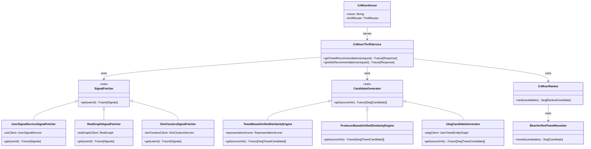
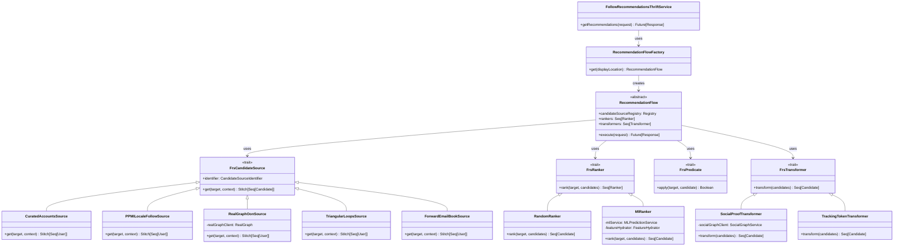
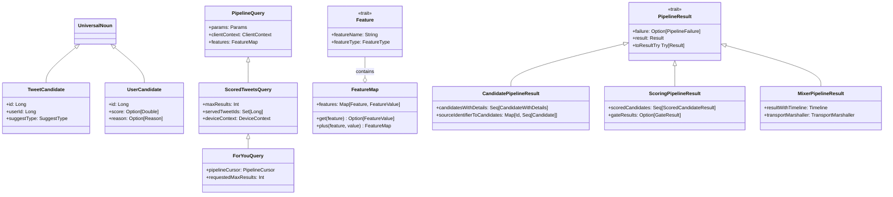
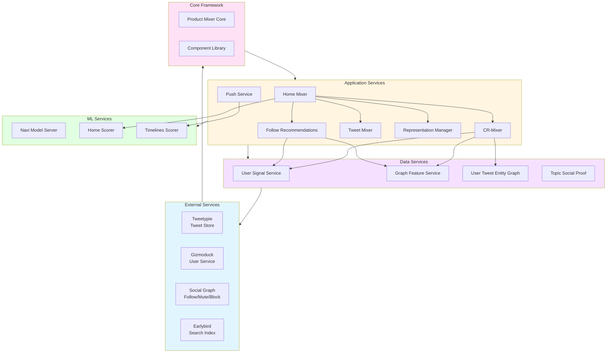

# Twitter Recommendation Algorithm - System Architecture Diagram

## Core Class Architecture

**Source Files:**
- `product-mixer/core/src/main/scala/com/twitter/product_mixer/core/pipeline/Pipeline.scala`
- `product-mixer/core/src/main/scala/com/twitter/product_mixer/core/pipeline/product/ProductPipeline.scala`
- `product-mixer/core/src/main/scala/com/twitter/product_mixer/core/pipeline/mixer/MixerPipeline.scala`
- `product-mixer/core/src/main/scala/com/twitter/product_mixer/core/pipeline/recommendation/RecommendationPipeline.scala`
- `product-mixer/core/src/main/scala/com/twitter/product_mixer/core/pipeline/candidate/CandidatePipeline.scala`
- `product-mixer/core/src/main/scala/com/twitter/product_mixer/core/pipeline/scoring/ScoringPipeline.scala`
- `home-mixer/server/src/main/scala/com/twitter/home_mixer/product/for_you/` (For You implementations)
- `home-mixer/server/src/main/scala/com/twitter/home_mixer/product/scored_tweets/candidate_pipeline/` (Candidate pipelines)
- `home-mixer/server/src/main/scala/com/twitter/home_mixer/product/scored_tweets/scoring_pipeline/` (Scoring pipelines)

```mermaid
classDiagram
    %% Base Pipeline Hierarchy
    class Pipeline {
        <<abstract>>
        #config: PipelineConfig
        +arrow: Arrow[Query, PipelineResult]
        +children: Seq[Component]
        +process(query: Query) Stitch[Result]
        +identifier: ComponentIdentifier
    }
    
    class ProductPipeline {
        <<abstract>>
        +config: ProductPipelineConfig
        +arrow: Arrow[Request, Response]
        +identifier: ProductPipelineIdentifier
    }
    
    class MixerPipeline {
        <<abstract>>
        +config: MixerPipelineConfig
        +arrow: Arrow[Query, MixerPipelineResult]
        +identifier: MixerPipelineIdentifier
    }
    
    class RecommendationPipeline {
        <<abstract>>
        +config: RecommendationPipelineConfig
        +arrow: Arrow[Query, RecommendationPipelineResult]
        +identifier: RecommendationPipelineIdentifier
    }
    
    class CandidatePipeline {
        <<abstract>>
        +config: CandidatePipelineConfig
        +arrow: Arrow[Inputs, CandidatePipelineResult]
        +identifier: CandidatePipelineIdentifier
    }
    
    class ScoringPipeline {
        <<abstract>>
        +config: ScoringPipelineConfig
        +arrow: Arrow[Inputs, ScoringPipelineResult]
        +identifier: ScoringPipelineIdentifier
    }
    
    Pipeline <|-- ProductPipeline
    Pipeline <|-- MixerPipeline
    Pipeline <|-- RecommendationPipeline
    Pipeline <|-- CandidatePipeline
    Pipeline <|-- ScoringPipeline
    
    %% Product Mixer Core Components
    class Component {
        <<trait>>
        +identifier: ComponentIdentifier
    }
    
    class PipelineQuery {
        <<trait>>
        +params: Params
        +clientContext: ClientContext
        +features: FeatureMap
    }
    
    class CandidateWithDetails {
        +candidate: UniversalNoun
        +source: CandidateSourceIdentifier
        +features: FeatureMap
    }
    
    class UniversalNoun {
        <<trait>>
        +id: Long
    }
    
    Pipeline --|> Component
    PipelineQuery ..> Pipeline : input
    CandidateWithDetails ..> UniversalNoun : contains
    
    %% Home Mixer Specific Classes
    class ForYouProductPipelineConfig {
        +identifier: ProductPipelineIdentifier
        +product: Product
        +pipelineSelector: ProductPipelineSelector
        +pipelines: Seq[Pipeline]
    }
    
    class ForYouMixerPipelineConfig {
        +identifier: MixerPipelineIdentifier
        +candidatePipelines: Seq[CandidatePipeline]
        +dependentCandidatePipelines: Seq[Pipeline]
        +gates: Seq[Gate]
        +selectors: Seq[Selector]
        +domainMarshaller: DomainMarshaller
    }
    
    class ForYouScoredTweetsCandidatePipelineConfig {
        +identifier: CandidatePipelineIdentifier
        +enabledDecider: Decider
        +recommendationPipeline: RecommendationPipeline
    }
    
    class ScoredTweetsRecommendationPipelineConfig {
        +identifier: RecommendationPipelineIdentifier
        +candidatePipelines: Seq[CandidatePipeline]
        +scoringPipelines: Seq[ScoringPipeline]
        +resultSelectors: Seq[Selector]
    }
    
    ProductPipeline <|.. ForYouProductPipelineConfig
    MixerPipeline <|.. ForYouMixerPipelineConfig
    CandidatePipeline <|.. ForYouScoredTweetsCandidatePipelineConfig
    RecommendationPipeline <|.. ScoredTweetsRecommendationPipelineConfig
    
    %% Candidate Source Configurations
    class ScoredTweetsInNetworkCandidatePipelineConfig {
        +candidateSource: EarlybirdCandidateSource
        +filters: Seq[Filter]
        +featuresFromCandidateSource: Seq[Feature]
    }
    
    class ScoredTweetsTweetMixerCandidatePipelineConfig {
        +candidateSource: TweetMixerCandidateSource
        +filters: Seq[Filter]
    }
    
    class ScoredTweetsUtegCandidatePipelineConfig {
        +candidateSource: UserTweetEntityGraphSource
        +queryTransformer: CandidatePipelineQueryTransformer
    }
    
    class ScoredTweetsFrsCandidatePipelineConfig {
        +candidateSource: FrsCandidateSource
        +filters: Seq[Filter]
    }
    
    CandidatePipeline <|.. ScoredTweetsInNetworkCandidatePipelineConfig
    CandidatePipeline <|.. ScoredTweetsTweetMixerCandidatePipelineConfig
    CandidatePipeline <|.. ScoredTweetsUtegCandidatePipelineConfig
    CandidatePipeline <|.. ScoredTweetsFrsCandidatePipelineConfig
    
    %% Scoring Pipeline Classes
    class ScoredTweetsModelScoringPipelineConfig {
        +identifier: ScoringPipelineIdentifier
        +gates: Seq[Gate]
        +selectors: Seq[Selector]
        +preFilterFeatureHydrationPhase1: Seq[FeatureHydrator]
        +scorers: Seq[Scorer]
    }
    
    class ScoredTweetsRerankingScoringPipelineConfig {
        +identifier: ScoringPipelineIdentifier
        +scorers: Seq[Scorer]
        +weighedModelRerankingScorer: Scorer
        +phoenixModelRerankingScorer: Scorer
    }
    
    ScoringPipeline <|.. ScoredTweetsModelScoringPipelineConfig
    ScoringPipeline <|.. ScoredTweetsRerankingScoringPipelineConfig
```

## Service Layer Architecture

**Source Files:**
- `home-mixer/server/src/main/scala/com/twitter/home_mixer/HomeMixerServer.scala`
- `home-mixer/server/src/main/scala/com/twitter/home_mixer/service/ScoredTweetsService.scala`
- `product-mixer/core/src/main/scala/com/twitter/product_mixer/core/product/registry/ProductPipelineRegistry.scala`
- `product-mixer/core/src/main/scala/com/twitter/product_mixer/core/service/candidate_pipeline_executor/CandidatePipelineExecutor.scala`
- `product-mixer/core/src/main/scala/com/twitter/product_mixer/core/service/scoring_pipeline_executor/ScoringPipelineExecutor.scala`
- `product-mixer/core/src/main/scala/com/twitter/product_mixer/core/service/selector_executor/SelectorExecutor.scala`
- `product-mixer/core/src/main/scala/com/twitter/product_mixer/core/service/gate_executor/GateExecutor.scala`
- `product-mixer/core/src/main/scala/com/twitter/product_mixer/core/pipeline/scoring/ScoringPipelineBuilder.scala`
- `product-mixer/core/src/main/scala/com/twitter/product_mixer/core/pipeline/mixer/MixerPipelineBuilder.scala`

```mermaid
classDiagram
    %% Core Service Classes
    class HomeMixerServer {
        +name: String
        +modules: Seq[Module]
        +configureThrift()
        +configureHttp()
    }
    
    class ScoredTweetsService {
        -productPipelineRegistry: ProductPipelineRegistry
        +getScoredTweetsResponse(request, params) Stitch[Response]
    }
    
    class ProductPipelineRegistry {
        -pipelines: Map[ProductIdentifier, ProductPipeline]
        +getProductPipeline(product) ProductPipeline
        +register(pipeline) Unit
    }
    
    HomeMixerServer --> ProductPipelineRegistry : uses
    ScoredTweetsService --> ProductPipelineRegistry : uses
    
    %% Executor Classes
    class Executor {
        <<trait>>
        +statsReceiver: StatsReceiver
        +arrow(config, context) Arrow
    }
    
    class CandidatePipelineExecutor {
        +arrow(pipelines, context) Arrow
        -executePipeline(pipeline) Result
    }
    
    class ScoringPipelineExecutor {
        +arrow(pipelines, context) Arrow
        -scoringPipelineArrow(pipeline) Arrow
    }
    
    class SelectorExecutor {
        +arrow(selectors, context) Arrow
        -runSelector(selector) Result
    }
    
    class CandidateFeatureHydratorExecutor {
        +arrow(hydrators, context) Arrow
        -hydrateFeatures(candidates) Result
    }
    
    class GateExecutor {
        +arrow(gates, context) Arrow
        -evaluateGate(gate) Boolean
    }
    
    Executor <|-- CandidatePipelineExecutor
    Executor <|-- ScoringPipelineExecutor
    Executor <|-- SelectorExecutor
    Executor <|-- CandidateFeatureHydratorExecutor
    Executor <|-- GateExecutor
    
    %% Pipeline Builders
    class PipelineBuilder {
        <<abstract>>
        #statsReceiver: StatsReceiver
        +build(parentStack, config) Pipeline
    }
    
    class MixerPipelineBuilder {
        -gateExecutor: GateExecutor
        -selectorExecutor: SelectorExecutor
        -candidatePipelineExecutor: CandidatePipelineExecutor
        +build(parentStack, config) MixerPipeline
    }
    
    class ScoringPipelineBuilder {
        -gateExecutor: GateExecutor
        -selectorExecutor: SelectorExecutor
        -candidateFeatureHydratorExecutor: Executor
        +build(parentStack, config) ScoringPipeline
    }
    
    class CandidatePipelineBuilder {
        -gateExecutor: GateExecutor
        -candidateSourceExecutor: Executor
        +build(parentStack, config) CandidatePipeline
    }
    
    PipelineBuilder <|-- MixerPipelineBuilder
    PipelineBuilder <|-- ScoringPipelineBuilder
    PipelineBuilder <|-- CandidatePipelineBuilder
    
    MixerPipelineBuilder ..> GateExecutor : uses
    MixerPipelineBuilder ..> SelectorExecutor : uses
    MixerPipelineBuilder ..> CandidatePipelineExecutor : uses
    ScoringPipelineBuilder ..> CandidateFeatureHydratorExecutor : uses
```

## Functional Components

**Source Files:**
- `product-mixer/core/src/main/scala/com/twitter/product_mixer/core/functional_component/candidate_source/CandidateSource.scala`
- `product-mixer/core/src/main/scala/com/twitter/product_mixer/core/functional_component/scorer/Scorer.scala`
- `product-mixer/core/src/main/scala/com/twitter/product_mixer/core/functional_component/feature_hydrator/`
- `product-mixer/core/src/main/scala/com/twitter/product_mixer/core/functional_component/filter/Filter.scala`
- `product-mixer/core/src/main/scala/com/twitter/product_mixer/core/functional_component/selector/Selector.scala`
- `product-mixer/core/src/main/scala/com/twitter/product_mixer/core/functional_component/gate/Gate.scala`
- `home-mixer/server/src/main/scala/com/twitter/home_mixer/functional_component/scorer/` (Home Mixer scorers)
- `home-mixer/server/src/main/scala/com/twitter/home_mixer/functional_component/feature_hydrator/` (Home Mixer feature hydrators)
- `home-mixer/server/src/main/scala/com/twitter/home_mixer/functional_component/filter/` (Home Mixer filters)

```mermaid
classDiagram
    %% Base Functional Component
    class FunctionalComponent {
        <<trait>>
        +identifier: ComponentIdentifier
    }
    
    %% Candidate Sources
    class CandidateSource {
        <<trait>>
        +identifier: CandidateSourceIdentifier
        +apply(request) Stitch[Seq[Candidate]]
    }
    
    class EarlybirdCandidateSource {
        -earlybirdClient: EarlybirdService
        +apply(request) Stitch[Seq[TweetCandidate]]
    }
    
    class TweetMixerCandidateSource {
        -tweetMixerClient: TweetMixerService
        +apply(request) Stitch[Seq[TweetCandidate]]
    }
    
    class UserTweetEntityGraphSource {
        -utegClient: UtegService
        +apply(request) Stitch[Seq[TweetCandidate]]
    }
    
    class FrsCandidateSource {
        -frsClient: FollowRecommendationsService
        +apply(request) Stitch[Seq[TweetCandidate]]
    }
    
    FunctionalComponent <|-- CandidateSource
    CandidateSource <|-- EarlybirdCandidateSource
    CandidateSource <|-- TweetMixerCandidateSource
    CandidateSource <|-- UserTweetEntityGraphSource
    CandidateSource <|-- FrsCandidateSource
    
    %% Scorers
    class Scorer {
        <<trait>>
        +identifier: ScorerIdentifier
        +apply(query, candidates) Stitch[Seq[FeatureMap]]
    }
    
    class HomeScorerScorer {
        -homeScorerClient: HomeScorerService
        +apply(query, candidates) Stitch[Scores]
    }
    
    class WeighedModelRerankingScorer {
        +apply(query, candidates) Stitch[Scores]
    }
    
    class PhoenixModelRerankingScorer {
        +apply(query, candidates) Stitch[Scores]
    }
    
    FunctionalComponent <|-- Scorer
    Scorer <|-- HomeScorerScorer
    Scorer <|-- WeighedModelRerankingScorer
    Scorer <|-- PhoenixModelRerankingScorer
    
    %% Feature Hydrators
    class FeatureHydrator {
        <<trait>>
        +identifier: FeatureHydratorIdentifier
        +features: Set[Feature]
        +apply(query) Stitch[FeatureMap]
    }
    
    class CandidateFeatureHydrator {
        <<trait>>
        +identifier: FeatureHydratorIdentifier
        +features: Set[Feature]
        +apply(query, candidate) Stitch[FeatureMap]
    }
    
    class AncestorFeatureHydrator {
        +features: Set[Feature]
        +apply(query, candidate) Stitch[FeatureMap]
    }
    
    class AuthorFeatureHydrator {
        -gizmoduckClient: GizmoduckService
        +apply(query, candidate) Stitch[FeatureMap]
    }
    
    FunctionalComponent <|-- FeatureHydrator
    FunctionalComponent <|-- CandidateFeatureHydrator
    CandidateFeatureHydrator <|-- AncestorFeatureHydrator
    CandidateFeatureHydrator <|-- AuthorFeatureHydrator
    
    %% Filters
    class Filter {
        <<trait>>
        +identifier: FilterIdentifier
        +apply(query, candidates) Stitch[FilterResult]
    }
    
    class PredicateFilter {
        +predicate: Predicate
        +apply(query, candidates) Stitch[FilterResult]
    }
    
    class VisibilityFilter {
        -visibilityLibrary: VisibilityLibrary
        +apply(query, candidates) Stitch[FilterResult]
    }
    
    FunctionalComponent <|-- Filter
    Filter <|-- PredicateFilter
    Filter <|-- VisibilityFilter
    
    %% Selectors
    class Selector {
        <<trait>>
        +identifier: SelectorIdentifier
        +apply(query, candidates) SelectorResult
    }
    
    class DropSelector {
        +pipelineScope: CandidatePipelineIdentifier
        +apply(query, candidates) SelectorResult
    }
    
    class InsertAppendResults {
        +candidatePipeline: CandidatePipelineIdentifier
        +apply(query, candidates) SelectorResult
    }
    
    FunctionalComponent <|-- Selector
    Selector <|-- DropSelector
    Selector <|-- InsertAppendResults
    
    %% Gates
    class Gate {
        <<trait>>
        +identifier: GateIdentifier
        +shouldContinue(query) Stitch[Boolean]
    }
    
    class ParamGate {
        +param: Param[Boolean]
        +shouldContinue(query) Stitch[Boolean]
    }
    
    FunctionalComponent <|-- Gate
    Gate <|-- ParamGate
```

## CR-Mixer Architecture

**Source Files:**
- `cr-mixer/server/src/main/scala/com/twitter/cr_mixer/CrMixerServer.scala`
- `cr-mixer/server/src/main/scala/com/twitter/cr_mixer/service/CrMixerThriftService.scala`
- `cr-mixer/server/src/main/scala/com/twitter/cr_mixer/source_signal/` (Signal fetchers)
- `cr-mixer/server/src/main/scala/com/twitter/cr_mixer/candidate_generation/` (Candidate generators)
- `cr-mixer/server/src/main/scala/com/twitter/cr_mixer/similarity_engine/` (Similarity engines)
- `cr-mixer/server/src/main/scala/com/twitter/cr_mixer/ranker/` (Rankers)
- `cr-mixer/server/src/main/scala/com/twitter/cr_mixer/filter/` (Filters)

## Follow Recommendations Service Architecture

**Source Files:**
- `follow-recommendations-service/server/src/main/scala/com/twitter/follow_recommendations/FollowRecommendationsServiceThriftServer.scala`
- `follow-recommendations-service/server/src/main/scala/com/twitter/follow_recommendations/flows/` (Recommendation flows)
- `follow-recommendations-service/common/src/main/scala/com/twitter/follow_recommendations/common/candidate_sources/` (Candidate sources)
- `follow-recommendations-service/common/src/main/scala/com/twitter/follow_recommendations/common/rankers/` (Rankers)
- `follow-recommendations-service/common/src/main/scala/com/twitter/follow_recommendations/common/predicates/` (Filters)
- `follow-recommendations-service/common/src/main/scala/com/twitter/follow_recommendations/common/transforms/` (Transformers)

## Data Models

**Source Files:**
- `product-mixer/core/src/main/scala/com/twitter/product_mixer/core/model/common/UniversalNoun.scala`
- `product-mixer/core/src/main/scala/com/twitter/product_mixer/core/model/common/presentation/CandidateWithDetails.scala`
- `product-mixer/core/src/main/scala/com/twitter/product_mixer/core/pipeline/PipelineQuery.scala`
- `home-mixer/server/src/main/scala/com/twitter/home_mixer/model/request/` (Query models)
- `home-mixer/server/src/main/scala/com/twitter/home_mixer/model/` (Home Mixer models)
- `product-mixer/core/src/main/scala/com/twitter/product_mixer/core/feature/` (Feature models)
- `product-mixer/core/src/main/scala/com/twitter/product_mixer/core/pipeline/PipelineResult.scala`
- `product-mixer/core/src/main/scala/com/twitter/product_mixer/core/pipeline/candidate/CandidatePipelineResult.scala`
- `product-mixer/core/src/main/scala/com/twitter/product_mixer/core/pipeline/scoring/ScoringPipelineResult.scala`

## Module Dependency Architecture

**Source Files:**
- `tweetypie/server/src/main/scala/com/twitter/tweetypie/` (Tweetypie)
- `src/java/com/twitter/search/earlybird/` (Earlybird)
- `src/scala/com/twitter/service/gen/scarecrow/` (Gizmoduck client)
- `src/scala/com/twitter/socialgraph/` (Social Graph)
- `product-mixer/core/` (Product Mixer Core)
- `product-mixer/component-library/` (Component Library)
- `home-mixer/server/` (Home Mixer)
- `cr-mixer/server/` (CR-Mixer)
- `follow-recommendations-service/` (FRS)
- `navi/navi/` (Navi ML serving)
- `user-signal-service/` (User Signal Service)
- `graph-feature-service/` (Graph Feature Service)
- `representation-manager/` (Representation Manager)

