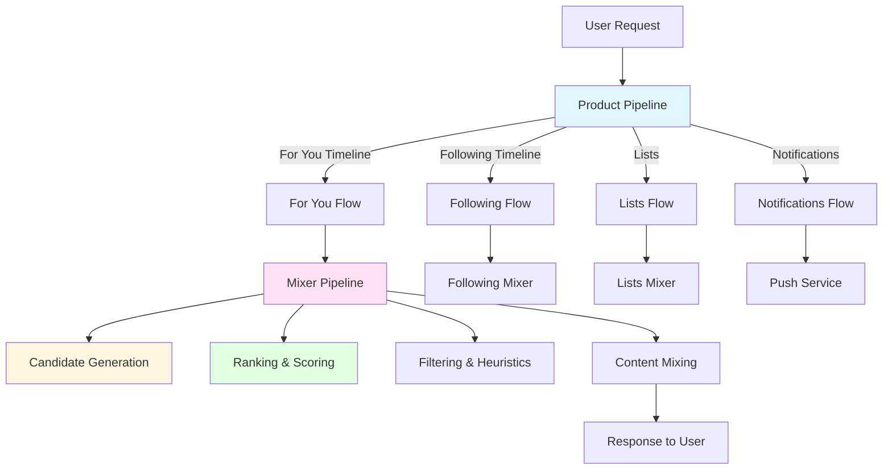
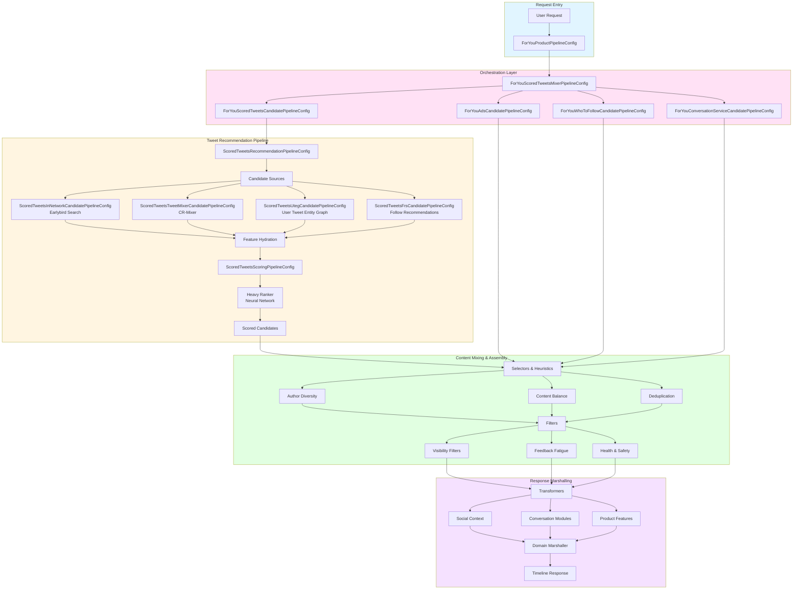
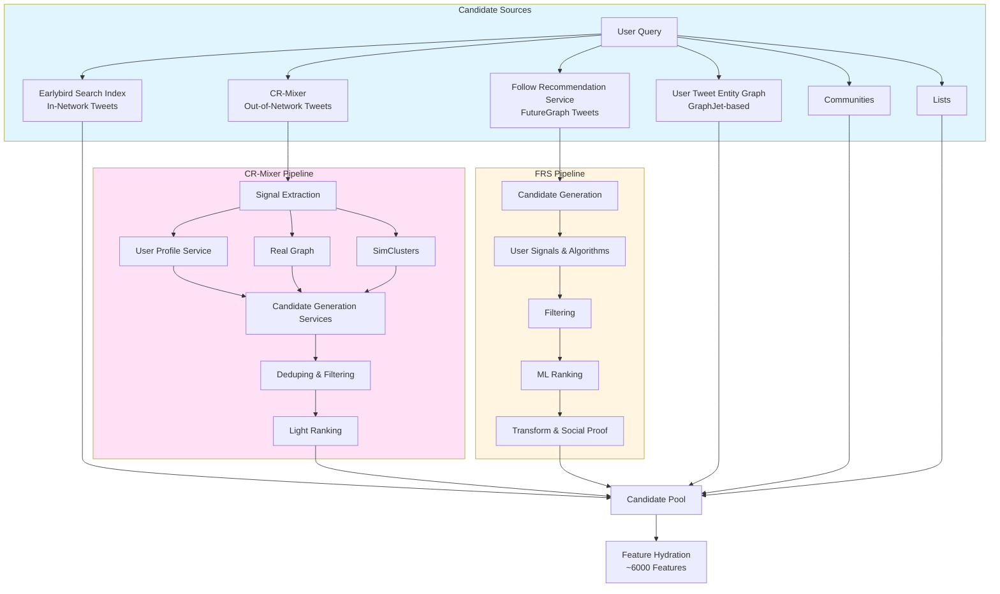
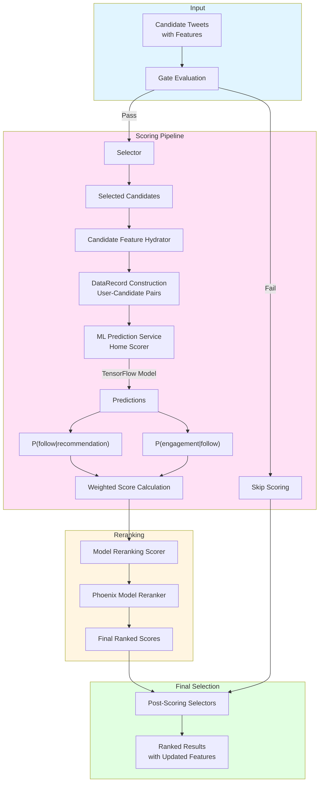
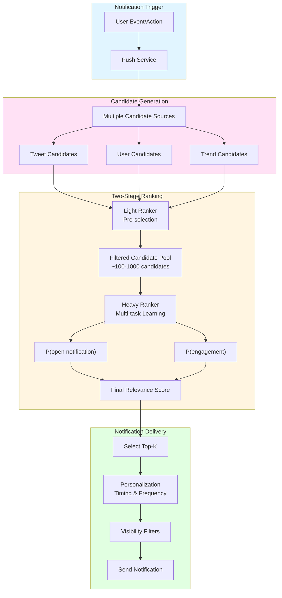

# Twitter Recommendation Algorithm - System Flow Diagram

## High-Level Request Flow

**Source Files:**
- `home-mixer/server/src/main/scala/com/twitter/home_mixer/product/for_you/ForYouProductPipelineConfig.scala`
- `home-mixer/server/src/main/scala/com/twitter/home_mixer/product/following/FollowingProductPipelineConfig.scala`
- `pushservice/src/main/scala/com/twitter/frigate/pushservice/PushServiceMain.scala`

## For You Timeline - Detailed Flow

**Source Files:**
- `home-mixer/server/src/main/scala/com/twitter/home_mixer/product/for_you/ForYouProductPipelineConfig.scala`
- `home-mixer/server/src/main/scala/com/twitter/home_mixer/product/for_you/ForYouScoredTweetsMixerPipelineConfig.scala`
- `home-mixer/server/src/main/scala/com/twitter/home_mixer/product/for_you/ForYouScoredTweetsCandidatePipelineConfig.scala`
- `home-mixer/server/src/main/scala/com/twitter/home_mixer/product/scored_tweets/ScoredTweetsRecommendationPipelineConfig.scala`
- `home-mixer/server/src/main/scala/com/twitter/home_mixer/product/scored_tweets/candidate_pipeline/`
- `home-mixer/server/src/main/scala/com/twitter/home_mixer/product/scored_tweets/scoring_pipeline/ScoredTweetsScoringPipelineConfig.scala`

## Candidate Generation Sources

**Source Files:**
- `home-mixer/server/src/main/scala/com/twitter/home_mixer/product/scored_tweets/candidate_pipeline/ScoredTweetsInNetworkCandidatePipelineConfig.scala`
- `home-mixer/server/src/main/scala/com/twitter/home_mixer/product/scored_tweets/candidate_pipeline/ScoredTweetsTweetMixerCandidatePipelineConfig.scala`
- `home-mixer/server/src/main/scala/com/twitter/home_mixer/product/scored_tweets/candidate_pipeline/ScoredTweetsUtegCandidatePipelineConfig.scala`
- `home-mixer/server/src/main/scala/com/twitter/home_mixer/product/scored_tweets/candidate_pipeline/ScoredTweetsFrsCandidatePipelineConfig.scala`
- `cr-mixer/server/src/main/scala/com/twitter/cr_mixer/` (CR-Mixer service)
- `follow-recommendations-service/server/src/main/scala/com/twitter/follow_recommendations/` (FRS service)
- `src/scala/com/twitter/recos/user_tweet_entity_graph/` (UTEG service)

## Scoring and Ranking Pipeline

**Source Files:**
- `product-mixer/core/src/main/scala/com/twitter/product_mixer/core/pipeline/scoring/ScoringPipeline.scala`
- `product-mixer/core/src/main/scala/com/twitter/product_mixer/core/pipeline/scoring/ScoringPipelineBuilder.scala`
- `home-mixer/server/src/main/scala/com/twitter/home_mixer/product/scored_tweets/scoring_pipeline/ScoredTweetsModelScoringPipelineConfig.scala`
- `home-mixer/server/src/main/scala/com/twitter/home_mixer/product/scored_tweets/scorer/`
- `product-mixer/component-library/src/main/scala/com/twitter/product_mixer/component_library/module/HomeScorerClientModule.scala`

## Data Flow Through Services

**Source Files:**
- `tweetypie/server/src/main/scala/com/twitter/tweetypie/` (Tweetypie service)
- `unified_user_actions/service/src/main/scala/com/twitter/unified_user_actions/service/` (UUA service)
- `user-signal-service/server/src/main/scala/com/twitter/usersignalservice/` (User Signal Service)
- `src/scala/com/twitter/simclusters_v2/` (SimClusters)
- `src/scala/com/twitter/interaction_graph/` (Real Graph)
- `graph-feature-service/src/main/scala/com/twitter/graph_feature_service/` (Graph Feature Service)
- `product-mixer/core/src/main/scala/com/twitter/product_mixer/core/` (Product Mixer framework)
- `navi/navi/src/` (Navi model serving)
- `representation-manager/server/src/main/scala/com/twitter/representation_manager/` (Representation Manager)

---

**Note for Mini-RecSys Implementation:**

Key differences from production Twitter architecture:
- **Data files**: Only 4 Parquet files (`users`, `tweets`, `interactions`, `follows`) - no pre-computed embeddings
- **Model serving**: PyTorch models loaded from `models/*.pt` files, predictions on-demand
- **Simplified pipeline**: Single-process execution vs distributed microservices
- **Feature computation**: 20 features vs 6000+ in production
- **Graceful fallback**: Falls back to feature-based heuristics if models not trained

```mermaid
flowchart LR
    subgraph DataSources["Data Sources"]
        Tweetypie[Tweetypie<br/>Tweet Data]
        UUA[Unified User Actions<br/>Real-time Stream]
        USS[User Signal Service<br/>Explicit & Implicit Signals]
    end
    
    subgraph Models["ML Models & Features"]
        SimClusters[SimClusters<br/>Community Detection]
        TwHIN[TwHIN<br/>Dense Embeddings]
        RealGraph[Real Graph<br/>User Interaction Prediction]
        TrustSafety[Trust & Safety Models<br/>NSFW/Abuse Detection]
        GraphFeatures[Graph Feature Service<br/>User-User Features]
    end
    
    subgraph Frameworks["Service Frameworks"]
        ProductMixer[Product Mixer<br/>Framework]
        Navi[Navi<br/>ML Model Serving]
        RepManager[Representation Manager<br/>Embedding Retrieval]
        TAF[Timelines Aggregation<br/>Framework]
    end
    
    subgraph Services["Core Services"]
        HomeMixer[Home Mixer]
        CRMixer[CR-Mixer]
        FRS[Follow Recommendations]
        TweetMixer[Tweet Mixer]
        PushService[Push Service]
    end
    
    DataSources --> Models
    Models --> Frameworks
    Frameworks --> Services
    
    Services --> Timeline[Timeline Response]
    Services --> Notifications[Notification Response]
    
    style DataSources fill:#e1f5ff
    style Models fill:#ffe1f5
    style Frameworks fill:#fff5e1
    style Services fill:#e1ffe1
```

## Push Notification Flow

**Source Files:**
- `pushservice/src/main/scala/com/twitter/frigate/pushservice/` (Push Service)
- `pushservice/src/main/scala/com/twitter/frigate/pushservice/model/candidate/`
- `pushservice/src/main/python/models/light_ranking/` (Light Ranker model)
- `pushservice/src/main/python/models/heavy_ranking/` (Heavy Ranker model)
- `pushservice/src/main/scala/com/twitter/frigate/pushservice/take/predicates/` (Filters)

